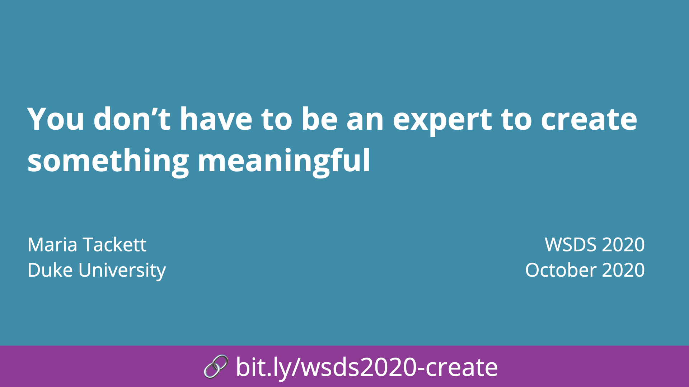

# You don't have to be an expert to create something meaningful 

## Women in Statistics and Data Science Conference - October 2020

## Abstract

It’s exciting when students in an introductory course become interested in statistics and data science. When they ask “what can I do next?”, however, they’re often left with little beyond a list of courses to take. In this talk, I share my experience supervising projects aimed at getting undergraduate students involved in data-driven projects after just one or two statistics courses. First, I’ll present a semester-long independent study with a student in the first year of the statistics curriculum and then discuss a 6-week summer project for students who’ve had at least one statistics course. I’ll share the learning outcomes and lessons learned from each project and conclude with the benefits these experiences have for students, faculty, the department, and the wider academic community.

## Slides

Click to access slides.

## Resources
